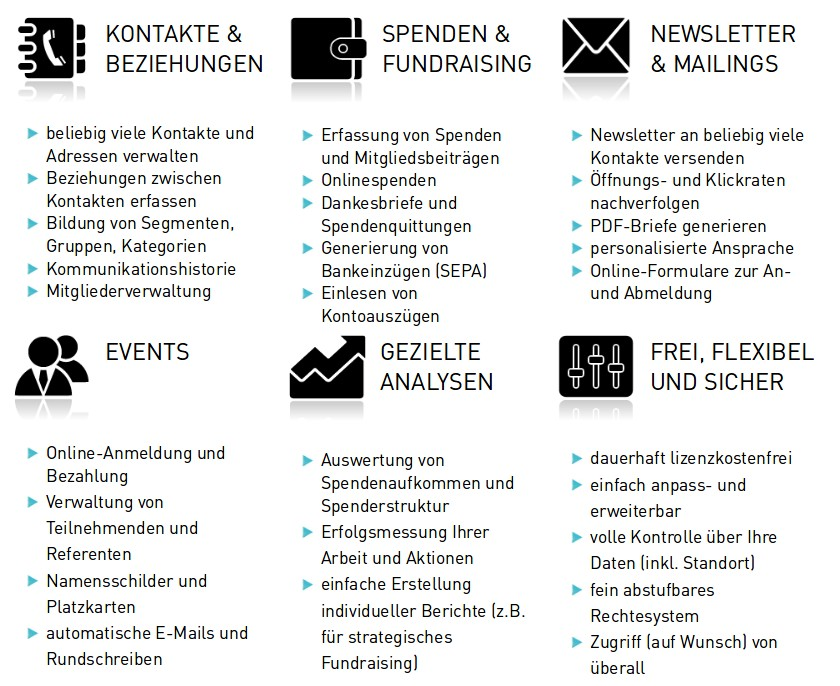

# Einführung

CiviCRM ist eine freie CRM-Software für Nonprofit-Organisationen. Dabei steht CRM für Constituent Relationship Management (oder auch Customer Relationship Management), was sich grob mit Kontakt- und Beziehungsmanagement übersetzen lässt. Das Hauptziel von CRM ist der gezielte und nachhaltige Aufbau von Beziehungen zu allen Arten von Stakeholdern, die eine Organisation hat. Weltweit setzen über 10.000 Vereine, Stiftungen, NGOs und Verbände CiviCRM ein. Es bietet nicht nur umfangreiche Funktionen im Bereich der Kontaktverwaltung, sondern auch Unterstützung für viele weitere Aufgaben, die in Management, Administration und Customer Relationship Management (CRM) von Nonprofit-Organisationen anfallen. Zu den Leistungsmerkmalen von CiviCRM zählen u.a. folgende Bereiche:

Weitere Funktionen werden durch eine stetig wachsende Zahl von Erweiterungen („Extensions“) angeboten. 
So bietet etwa die Extension CiviHR umfassende Funktionen für die Personalverwaltung. Ziel dieses Leitfadens ist, neuen/unerfahrenen Benutzerinnen und Benutzern einen schnellen Einstieg und eine gute Orientierung über Funktionsweise und Logik von CiviCRM zu bieten. Demzufolge gehen wir vor allem auf anwendungsorientierte Fragen und nur in Ausnahmefällen auf administrative oder besonders komplexe Aufgaben ein. Wir erheben keinen Anspruch auf Vollständigkeit oder Richtigkeit, bemühen uns aber, den Leitfaden ständig weiter zu entwickeln und wo nötig zu überarbeiten und zu korrigieren. Fragen, Anmerkungen, Kommentare und konstruktive Kritik sind uns sehr willkommen. 
Über diesen Leitfaden hinaus gibt es noch weitere empfehlenswerte Informationsquellen:

[**StackExchange**](https://civicrm.stackexchange.com/)

StackExchange ist eine Plattform für themenspezifische Fragen und Antworten für Anwender, Administratorinnen und Implementier. Sie ist eine gute Anlaufstelle bei Fragen oder Problemen, die bei der Nutzung von CiviCRM entstehen können.

[**Benutzerhandbuch**](https://docs.civicrm.org/user/en/4.6/)

Im sehr umfangreichen englischen Benutzerhandbuch wird ausführlich auf die Nutzung und damit zusammenhängende grundlegende Fragen eingegangen. Es eignet sich insbesondere für einen vertieften Einstieg in CiviCRM oder wenn man sich einen neuen Funktionsbereich systematisch erschließen möchte.

[**Cookbook**](https://www.packtpub.com/web-development/civicrm-cookbook)

Das CiviCRM-Cookbook ist eine Sammlung so genannter "Rezepte". Jedes Rezept nimmt Bezug auf ein bestimmtes Thema oder Problem in CiviCRM. Daraus ergibt sich eine feste Struktur: jeweils 1 bis 2 Absätze um das Thema oder Problem darzustellen, dann ein Abschnitt "How to do it " mit den erforderlichen Schritten, um das Ziel zu erreichen und ein Abschnitt "How it works " mit einigen Hintergrundinformationen. Zudem gibt es jeweils einen Abschnitt "See also ", mit Links zu Online-Ressourcen oder anderen Rezepten im Buch. 

[**Offizielle Foren**](https://forum.civicrm.org/)

In den englischsprachigen CiviCRM-Foren tauschen sich User, Entwickler und das Core-Team über unterschiedlichste CiviCRM-Themen aus. Seit der Einführung von StackExchange wird das Forum vor allem noch für Diskussionen genutzt, konkrete Fragen hingegen auf der neuen Plattform gestellt und beantwortet.

[**Issuetracker (JIRA)**]()

Dies ist der offizielle Issue-Tracker von CiviCRM. Hier werden technische Probleme oder neu zu entwickelnde Funktionen erfasst und deren Bearbeitungsstand dokumentiert.

[**Mailingliste SfE**](https://sfe-ev.org/mailinglist)

Über die deutschsprachige Mailingliste tauschen sich deutsche User über CiviCRM aus. Betreut wird sie vom Verein „Software für Engagierte“, dessen Ziel eine Interessenaggregation von deutschsprachigen CiviCRM-Usern ist.

CiviCRM ist weitgehend individuell anpassbar, und auch die verschiedenen Versionen können funktionale und/oder optische Unterschiede aufweisen. Es kann also sein, dass sich im Detail Unterschiede zu der Instanz von CiviCRM ergeben, mit der Sie – vielleicht jetzt im Moment – arbeiten. Dieser Leitfaden bezieht sich auf eine (deutsch) lokalisierte, ansonsten aber weitestgehend unveränderte Standardinstallation der Version 4.4 unter Drupal 7. Leserinnen sollten zudem beachten, dass viele Funktionen abhängig von den Rechten des eigenen Benutzerkontos und von der globalen Konfiguration der Installation sind. Bestimmte hier beschriebene Funktionen können daher nicht, nur eingeschränkt oder beispielsweise unter anderen Namen zur Verfügung stehen.

CiviCRM ist freie Software und im Original englischsprachig. Die Übersetzung wird von Freiwilligen geleistet und ist noch nicht zu 100% abgeschlossen. Sie finden daher zur Zeit gelegentlich noch unübersetzte Textteile.

Dieser Leitfaden beginnt mit der Darstellung der technischen Grundlagen in Kapitel 2. Dort sind die Installation, die Grundkonfiguration sowie die Integrationsmöglichkeit in Ihre eigene Webseite beschrieben. Das daran anschließende Kapitel 3 enthält Hinweise zum Management von Kontakten und Beziehungen. Es wird ausführlich dargestellt was mit Hilfe von CiviCRM in der Kontaktverwaltung möglich ist. Kapitel 4 beschäftigt sich mit dem Themenfeld Kommunikation und Interaktion. Unter anderem werden dort die Funktionen für Massenmails und Newsletter sowie die Verwendung von Vorlagen vorgestellt.
