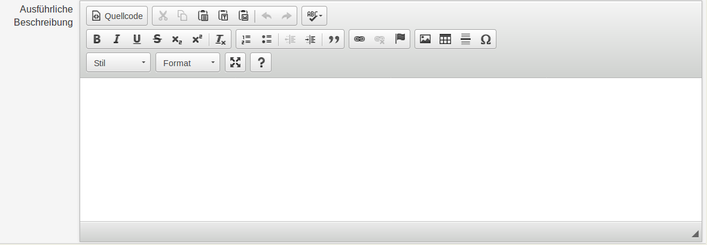
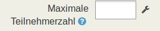
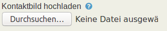
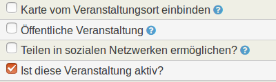
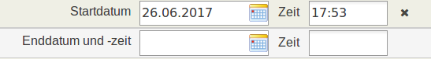
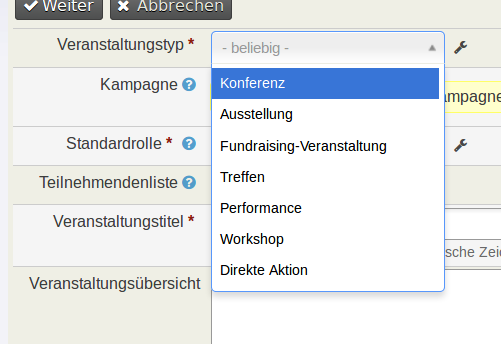

# Custom Fields

## Einleitung

Diese Anleitung soll eine Hilfestellung bei der Erstellung der neuen Datenstruktur, wie sie in CiviCRM abgebildet werden soll, sein. Ziel ist es die von SYSTOPIA bereitgestellte tabellarische Vorlage ausfüllen zu können. Diese dient als Grundlage für die Serverkonfiguration und wird automatisch verarbeitet. Daher sollen dort alle Angaben zusammen gefasst werden, die die zukünftigen Einstellungen in CiviCRM betreffen. Es geht dabei nicht um die Migration der vorhandenen Daten in das neue System, sondern um den vorgelagerten Schritt – die Erstellung der Daten-Struktur.
Dafür werden im Folgenden zunächst die einzelnen Begriffe erklärt.

## Begriffsklärung

### Gruppen und Tags

Gruppen und Tags eignen sich gut, um Kontakte zu organisieren und zusammenzufassen, beispielsweise solche, die wiederholt per E-Mail oder Brief kontaktiert werden sollen. Dabei sind sowohl Gruppen als auch Tags Möglichkeiten Kontakte zu markieren und zu kategorisieren. Es ist von dem Einsatzszenario abhängig, welche der beiden Methoden jeweils geeigneter ist. Um zu entscheiden ob die Verwendung eines Tags oder das Anlegen einer Gruppe sinnvoller ist, lohnt es sich die Funktionen der beiden Methoden genauer anzuschauen. 
Tags sind dabei eher als beschreibende Elemente von Kontakten, Aktivitäten und Fällen zu verstehen. Gruppen hingegen fassen ausschließlich Kontakte zusammen, die dann eine Einheit bilden, welche beispielsweise für Mailings verwendet werden können.
In allen Fällen müssen dazu im Vorfeld die entsprechenden Tags bzw. Gruppen angelegt werden. Die benötigten Gruppen und Tags können dafür in die „Vorlage Datenstruktur“ eingetragen und im Zuge der Serverkonfiguration teil-automatisch erstellt werden.

### Statische Gruppen

Statische Gruppen müssen vor der Benutzung angelegt und dann die enthaltenen Kontakte manuell hinzugefügt werden. Es besteht die Möglichkeit, einen Namen und eine Beschreibung für die Gruppe einzugeben. Weiterhin kann angeben werden, ob die Gruppe auch eine Mailingliste ist – nur dann können Nutzer mit entsprechender Berechtigung Massenmailings an die Gruppe schicken. Wenn die Gruppe eine Mailingliste ist, können Kontakte sich selbst über einen Abbestell-Link aus der Mailingliste austragen – sie sind dann zwar immer noch in der Gruppe, bekommen aber keine Massenmails für diese Gruppe mehr. Schließlich lässt sich festlegen, ob es eine übergeordnete Gruppe gibt, also beispielsweise „Ehrenamtliche“ als Eltern-Gruppe von „Studenten“.

### Dynamische Gruppen

Dynamische Gruppen bieten grundsätzlich dieselben Möglichkeiten wie statische, haben aber einen entscheidenden Unterschied. Kontakte werden nicht manuell hinzugefügt oder entfernt sondern automatisch und zwar aufgrund bestimmter, vorher definierter Kontaktmerkmale. Beispielsweise kann für die (fiktive) dynamische Gruppe „VIP-Mitglieder in NRW“ festgelegt werden, dass darin alle Kontakte enthalten sein sollen, in deren Bundesland-Adressfeld „Nordrhein Westfalen“ steht, und die das Tag „VIP“ haben. Zieht bei diesem Beispiel ein Kontakt aus NRW weg bzw. nach NRW, reicht alleine die Änderung seiner Adresse um ihn automatisch aus der dynamischen Gruppe zu entfernen bzw. ihn zu selbiger hinzuzufügen.
Dynamische Gruppen sind daher sehr gut geeignet, um Kontakte in der Datenbank nach gewünschten Kriterien zu segmentieren und diese dann zielgruppengerecht zu bedienen. Die Qualität der dynamischen Gruppen hängt dabei natürlich von der Qualität und Aktualität der Daten ab, sodass hierauf besonderes Augenmerk gelegt werden muss.
Auch für die dynamischen Gruppen wird ein Name und eine Beschreibung angegeben. Zudem wird festgelegt, ob es sich bei der Gruppe um eine Mailingliste handelt.

### Tags

Bei Tags handelt es sich um eine Art abstraktes Etikett, also eine zusätzliche Auszeichnung, die zur Kennzeichnung von Kontakten vergeben werden kann. Es können beliebig viele Tags eingesetzt werden. Die Verwendung von Tags ist dabei optional. Bei der Definition von neuen Tags sollt darauf geachtet werden, dass es nicht zu Überschneidungen mit bestehenden Tags kommt. Außerdem ist es ratsam nicht zu viele Variablen zu erstellen, um die Übersichtlichkeit zu wahren. Mit Hilfe der verwendeten Tags können Kontakte zusammengefasst sowie gefiltert werden. Auch Aktivitäten lassen sich damit klassifizieren, im Gegensatz zu Gruppen, die nur bei Kontakten eingesetzt werden können. 
Um Tags vergeben zu können, müssen diese im Vorhinein definiert und angelegt werden. Dies ist im Zuge der Serverkonfiguration teil-automatisch möglich. Dafür sollten ein klarer und eindeutiger Name und eine erläuternde Beschreibung sowie weitere Eigenschaften in der „Vorlage Datenstruktur“ hinterlegt werden.

### Benutzerdefinierte Felder

Bei Feldern im Allgemeinen handelt es sich um Informationseinheiten, die in eine Datenbank eingegeben werden können. Benutzerdefinierte Felder im Besonderen sind eine Gruppe von Feldern, die eine Reihe von Informationen zu einem bestimmten Datensatz enthalten. Benutzerdefinierte Felder ermöglichen es Informationen zu Datensätzen, über die standardmäßig in CiviCRM vorgesehen Informationen hinaus, zu hinterlegen. Sie werden in CiviCRM immer als Set angelegt. Daher handelt es sich beim Anlegen von benutzerdefinierten Feldern um einen zweistufigen Prozess. In einem ersten Schritt wird der benutzerdefinierte Feldsatz als Feld-Gruppe, in der die benutzerdefinierten Felder thematisch gebündelt sind, angelegt. In einem zweiten Schritt werden dann die eigentlichen Felder zu dem aktuellen Feldsatz hinzugefügt. In der „Vorlage Datenstruktur“ ist es daher wichtig, dass für jede Feldgruppe ein eigenes Tabellenblatt angelegt und mit den entsprechenden Feldern gefüllt wird.
Im Zuge der Feldsatz-Anlage muss die Zuordnung des Feldsatzes zu einem Objekt festgelegt werden. Diese Zuordnung sollte gut überlegt sein, da sie im Nachhinein nicht geändert werden kann. Die Feldsätze können dabei mit unterschiedlicher Tragweite angelegt werden. So können sie beispielsweise allen Kontaktarten, nur einem bestimmten Kontakt-Typ, einer bestimmten Komponente oder einem Element, wie Beziehung oder Gruppe, zugeordnet werden. Ist also der neu angelegte Feldsatz mit dem Kontakt-Typ „Person“ assoziiert, kann dies nicht mehr geändert werden und eine Zuordnung zu einem anderen Objekt ist nicht mehr möglich. 
Die Beantwortung der folgenden Fragen kann bei der Entscheidungsfindung bezüglich der Zuordnung hilfreich sein:
1. Wie werden die Felder in diesem Satz verwendet werden?
2. Für welche Arten von Kontakten oder Datensätze sind diese Felder geeignet?
3. Sollen die Felder breit eingesetzt werden, oder enthalten sie Informationen ausschließlich zu einem bestimmten Kontakt-Typ?
Sofern die hier aufgeführten Fragen im Vorfeld beantwortet sind, ist die Gefahr überflüssige Felder anzulegen sehr gering. Sie können dann mit der Erstellung des Feldsatzes in der „Vorlage Datenstruktur“ beginnen.

### Beziehungen

Beziehungen beschreiben einen bestimmten Zusammenhang von zwei oder mehr Kontakten in CiviCRM. Sie ermöglichen die Auswertung relevanter Informationen beispielsweise das Auffinden von Kontakten, die mit einem anderen Kontakt in Zusammenhang stehen. Beziehungen werden in CiviCRM somit angelegt bzw. nach gehalten, um bessere Möglichkeiten zum gezielten Finden von Kontakten mit bestimmten Merkmalen zu haben und Beziehungsmuster auswerten zu können. 
In CiviCRM gibt es vorgefertigte Beziehungen, beispielsweise „Arbeitgeber von“/“Arbeitnehmer bei“ oder „Elternteil von“/„Kind von“. Administratoren können bei Bedarf weitere Beziehungen anlegen bzw. bestehende ändern oder umbenennen. Auch im Zuge der Serverkonfiguration können Beziehungen teil-automatisch angelegt werden.
Beziehungen haben immer eine A-B-Richtung (z.B. „Arbeitgeber von“) und eine B-A-Richtung (z.B. „Arbeitnehmer bei“). Beziehungen bestehen immer zwischen zwei bestimmten Kontaktarten, also z.B. Person-Person (Eltern-Kind) oder Organisation-Person (Arbeitgeber-Arbeitnehmer). Verwendung und Verwaltung von Beziehungen zählt zu den optionalen Konfigurationsschritten. Eine detaillierte Darstellung sowie Erläuterungen dazu sind im englischsprachigen Leitfaden unter dem Menüpunkt Beziehungen enthalten.
Beziehungen können sehr wertvolle Informationen liefern, beispielsweise für Fundraiserinnen, die das Spendenaufkommen analysieren oder nur einen Brief pro Haushalt verschicken wollen. Die Beziehungen zu erheben und zu pflegen kann jedoch ressourcenaufwendig sein – demzufolge sollte gut überlegt werden, welche Beziehungen für die eigene Organisation relevant sind und somit genutzt werden. Um eine Beziehung anzulegen oder zu bearbeiten wird der entsprechende Kontakt aufgerufen und der Reiter „Beziehungen“ ausgewählt – hier werden alle vorhanden Beziehungen sowie die Schaltfläche Beziehung hinzufügen angezeigt. Wird letztere ausgewählt, kann eine Beziehung definiert und dabei auch festlegt werden, ob es sich um eine aktive oder inaktive (frühere) Beziehung handelt. Zudem kann ein Start- und Enddatum der Beziehung bestimmt und Notizen anlegt werden. Besonderheit: Die Beziehung „Arbeitnehmer von“ kann auch direkt im Bearbeitungsmodus der Kontaktübersicht eines Kontakts bearbeitet werden.

## Verfahren

In der „Vorlage Datenstruktur“ ist es daher wichtig, dass für jede Feldgruppe ein eigenes Tabellenblatt angelegt und mit den entsprechenden Feldern gefüllt wird. Dazu wird der Inhalt des Tabellen-Blattes „Vorlage Feldgruppe“ kopiert und in ein neues Tabellen-Blatt eingefügt. Dann sollte das Tabellen-Blatt umbenannt werden und einen aussagekräftigen Namen erhalten. Anschließend kann das neue Tabellen-Blatt ausgefüllt werden. Dadurch wird die Datenstruktur der Datenbank definiert.
Wichtig ist an der Stelle, dass die in diesem Dokument erarbeitete Struktur die endgültige ist. Also dann genau so in CiviCRM abgebildet wird. Kleine Anpassungen sind im Zuge der Datenmigration noch möglich, sollten allerdings vermieden werden, um den Prozess nicht zu verzögern.
Zudem  ist es wichtig, dass die standardisierte Form eingehalten wird, da wir die gelieferten Daten mit Hilfe von teilautomatisierten Migrationsroutinen über die CiviCRM-API in die Datenbank übertragen, womit auch eine Reproduzierbarkeit des Imports sichergestellt ist. Dies ist erforderlich da meist mehrere Iterationen erforderlich sind, bis alle Daten entsprechend den Anforderungen übertragen wurden.
Konkret wird zunächst eine Teilmenge von Kontakten importiert, anschließend erhalten Ressourcenpersonen beim Auftraggeber ein kurzes Onlinetraining, das sie in die Lage versetzt, das Importergebnis zu überprüfen und Feedback über benötigte Änderungen zu geben. In mehreren, gewöhnlich ca. 3-5 Schleifen (Import – Testen – Feedback – Anpassung – Import…), werden Importroutinen und Einstellungen optimiert bis das gewünschte Ergebnis erreicht ist.

## Vorlage.

## Beschreibung der verschiedenen Entities.

### Felder.

Benutzerdefinierte Felder können, wie oben beschrieben, an sämtliche Objekte in CiviCRM als Set angehängt werden. Diese Objekte können Kontakte – Personen, Haushalte oder Organisationen -, Zuwendungen bzw. Spenden, Mitgliedschaften, Veranstaltungen, Anmeldungen, Aktivitäten oder Beziehungen sein. Dabei können die Felder verschiedene Ausprägungen haben. Mögliche Arten sind im Folgenden dargestellt:

#### Art des Feldes

Alphanumerisch – Buchstaben, Zahlen und Sonderzeichen
Bundesland – Auswahlliste mit den Bundesländern von Deutschland und/oder Österreich
Datei – Feld, das das hochladen einer Datei unterstützt
Datum – Datumsfeld mit Auswahlmöglichkeit aus einem Kalender
Geld – Zahlen mit zwei Nachkommastellen
ganze Zahl – nur ganze Zahlen
Ja oder Nein – „Ist“- oder „Ist nicht“-Auswahl
Kontaktreferenz - ??
Land – ISO-Liste der Länder der Welt
Link – Feld, das das einfügen eines Links unterstützt
Notiz – Feld zur Freitexteingabe
Zahl – ganze und Dezimalzahlen

#### Zusatzinformation zur Art des Feldes

Auswahlliste – Liste mit festen Einträgen, aus der genau ein Eintrag auswählt werden kann.
Auswahlliste mit Mehrfachauswahl – Liste mit festen Einträgen, aus der ein oder mehrere Einträge ausgewählt werden können. 
Autovervollständigung – die Eingabe wird sinnvoll ergänzt
Check-Box – Gruppe von ankreuzbaren Kontrollfeldern, bei denen eins oder mehrere auswählt werden können.
Editor mit Formatierungsfunktion – Eingabe von Freitext mit bis zu 500 Zeichen. Unterstützung der Formatierung durch einen Editor.
Mehrfachauswahl – es kann ein, kein oder mehrere der vordefinierten Einträge ausgewählt werden
Radio-Button – Gruppe von beschrifteten Kontrollfeldern, von denen eins auswählt werden muss. Dabei kann immer nur einer der Radio-Buttons ausgewählt werden.
Text – Eingabe von Freitext mit bis zu 120 Zeichen.
Textfeld – Eingabe von Freitext mit bis zu 250 Zeichen

Zur Veranschaulichung nun noch einige Bilder zu den einzelnen Feldarten:

##### Text klein

Hier kann Freitext mit einer Länge von bis zu 120 Zeichen eingegeben werden.

##### Text groß

Hier kann Freitext mit einer Länge von bis zu 250 Zeichen eingegeben werden.

##### Text mit Editor

Hier kann Freitext mit einer Länge von bis zu 500 Zeichen eingegeben werden. Dabei kann der Text mit Hilfe eines Editors formatiert werden.

##### Zahlenfeld

Hier können ausschließlich Zahlenwerte eingegeben werden. Dabei kann auch festgelegt werden, wie viele Stellen zugelassen sind, und ob es möglich ist auch Dezimalzahlen einzugeben.

##### Datei

Hier kann eine Datei hochgeladen und angehängt werden.

##### Checkbox

Hier ist eine einfache Auswahl – ist oder ist nicht – durch setzen von Häkchen möglich. Dabei ist eine Mehrfachauswahl, also die Auswahl mehrerer Optionen gleichzeitig,  zugelassen.

##### Datum und Uhrzeit

Hier kann ein Datum aus einem Kalender ausgewählt oder händisch eingetragen werden. Optional ist es möglich auch noch die Uhrzeit anzugeben.

##### Auswahlliste

Hier kann eine Option aus einem Ausklapp-Menü ausgewählt werden. Auch hier kann, wenn gewünscht, eine Mehrfachauswahl zugelassen werden, so dass mehrere Optionen nebeneinander angezeigt werden.

### Gruppen und Tags

## Beziehnungsarten

## Hinweis

